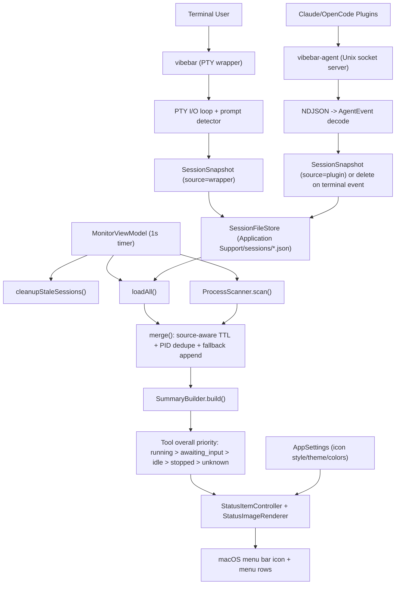

# VibeBar

VibeBar is a lightweight macOS menu bar app that monitors live TUI session activity for **Claude Code**, **Codex**, and **OpenCode**.

It gives you an at-a-glance signal of what your AI CLI sessions are doing right now: running, waiting for input, idle, or stopped.

## Why VibeBar

- Real-time status in the menu bar with per-state visual encoding
- Built for multi-session workflows (multiple tools, multiple terminals)
- Uses three data sources for reliability:
  - PTY wrapper (`vibebar`) for high-fidelity interactive detection
  - Local plugin events via `vibebar-agent` socket
  - `ps` process scanning fallback (zero-intrusion)

## Key Features

- Monitors `claude`, `codex`, and `opencode` sessions
- Detects and aggregates session states:
  - `running`
  - `awaiting_input`
  - `idle`
  - tool-level overall state includes `stopped`
- Multiple menu bar icon styles:
  - Ring
  - Particles
  - Energy Bar
  - Ice Grid
- Built-in color themes + custom per-state colors
- In-app plugin status and install/uninstall actions (Claude/OpenCode), plus plugin update flow for Claude
- Launch at login support
- Auto-check updates from GitHub Releases
- Multi-language UI (`English`, `中文`, `日本語`, `한국어`)

## Architecture

VibeBar is split into focused targets:

- `VibeBarCore`: shared models, storage, scanners, aggregation, plugin detection
- `VibeBarApp`: macOS menu bar application and settings UI
- `VibeBarCLI` (`vibebar`): transparent PTY wrapper around target CLIs
- `VibeBarAgent` (`vibebar-agent`): local Unix socket server for plugin events
- `plugins/*`: Claude and OpenCode plugin packages

Runtime data paths:

- Session files: `~/Library/Application Support/VibeBar/sessions/*.json`
- Agent socket: `~/Library/Application Support/VibeBar/runtime/agent.sock`

## Working Principle

VibeBar builds a single real-time view from three channels:

- `vibebar` PTY wrapper: high-fidelity interactive state (`running` / `awaiting_input` / `idle`)
- `vibebar-agent` socket events: plugin-driven lifecycle/status updates
- `ps` process scanning: fallback discovery when wrapper/agent data is missing



Merge and cleanup rules (implementation-aligned):

- Wrapper sessions are heartbeat-driven and expire quickly if heartbeat stops.
- Plugin sessions prefer PID liveness when PID is available; stale unknown-PID plugin sessions use timeout fallback.
- Sessions with the same PID are deduplicated by newest `updatedAt`.
- `ps` scan results are appended only when no stronger session source already covers that PID.

## Installation

### Option A: Download app (recommended)

1. Download the latest `VibeBar-*-universal.dmg` from [GitHub Releases](https://github.com/yelog/VibeBar/releases)
2. Drag `VibeBar.app` into `Applications`
3. On first launch, right-click the app and choose **Open** (Gatekeeper)
4. VibeBar starts as a menu bar app

Notes:

- In packaged builds, `vibebar-agent` is auto-started by the app when possible
- Plugin features require the corresponding CLI tools to be installed

### Option B: Build from source

Requirements:

- macOS 13+
- Xcode Command Line Tools
- Swift 6.2

```bash
swift build
```

## Quick Start (Source Build)

1. Start the menu bar app:

```bash
swift run VibeBarApp
```

2. In another terminal, start the agent (recommended for plugin events):

```bash
swift run vibebar-agent --verbose
```

3. Launch your AI CLI through the wrapper:

```bash
swift run vibebar claude
swift run vibebar codex
swift run vibebar opencode
```

Pass through native arguments as-is:

```bash
swift run vibebar codex -- --model gpt-5-codex
```

## Plugin Integration

For local development setup:

```bash
bash scripts/install/setup-local-plugins.sh
```

Plugin docs:

- `plugins/README.md`
- `plugins/claude-vibebar-plugin/README.md`
- `plugins/opencode-vibebar-plugin/README.md`

### Agent event format (NDJSON)

Plugins send newline-delimited JSON to the agent socket, for example:

```json
{"source":"claude-plugin","tool":"claude-code","session_id":"abc","event_type":"session_started"}
{"source":"opencode-plugin","tool":"opencode","session_id":"abc","status":"running"}
```

## State Detection Model

VibeBar merges three channels:

- PTY wrapper (`vibebar`):
  - `running`: recent output activity (< 0.8s)
  - `awaiting_input`: prompt pattern detection with latch behavior
  - `idle`: process alive with no recent output
- Plugin events (`vibebar-agent`):
  - structured status from Claude/OpenCode plugins
  - session lifecycle cleanup on terminal events
- Process scanning fallback:
  - detects target processes from `ps`
  - maps CPU activity to `running` / `idle`

Tool-level overall state priority:

`running` > `awaiting_input` > `idle` > `stopped` > `unknown`

## Settings

VibeBar settings include:

- Language selection (system/default and explicit language override)
- Menu bar icon style
- Color theme (preset and custom per-state colors)
- Launch at login
- Auto update checks

## Development

Build targets:

```bash
swift build
swift build -c release
```

Run:

```bash
swift run VibeBarApp
swift run vibebar-agent --verbose
swift run vibebar claude
```

Package a universal `.dmg`:

```bash
bash scripts/build/package-app.sh
```

Current testing status:

- No formal automated test suite yet (`swift test` placeholder)

## Troubleshooting

### Menu bar icon does not appear

- Ensure you are running inside a local macOS GUI login session (not SSH/headless)
- Restart app process:

```bash
pkill -f VibeBarApp || true
swift run VibeBarApp
```

### Sessions look stale

- Use **Purge Stale** from menu, or restart the wrapper session
- Verify session files under:
  `~/Library/Application Support/VibeBar/sessions`

### Cannot detect plugin events

- Ensure `vibebar-agent` is running
- Check socket path:

```bash
swift run vibebar-agent --print-socket-path
```

## Known Limitations

- Without plugins, some states rely on heuristics (especially awaiting-input detection)
- Codex currently has no dedicated plugin event channel in this repo
- Session history analytics and long-term metrics are not implemented yet
