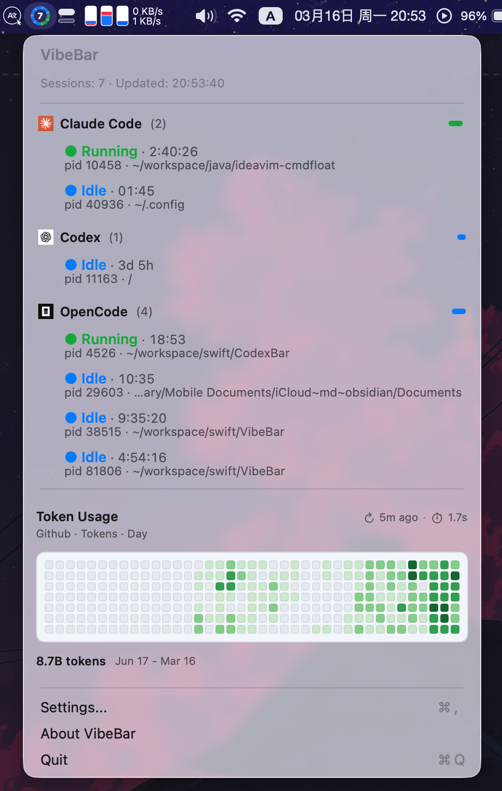
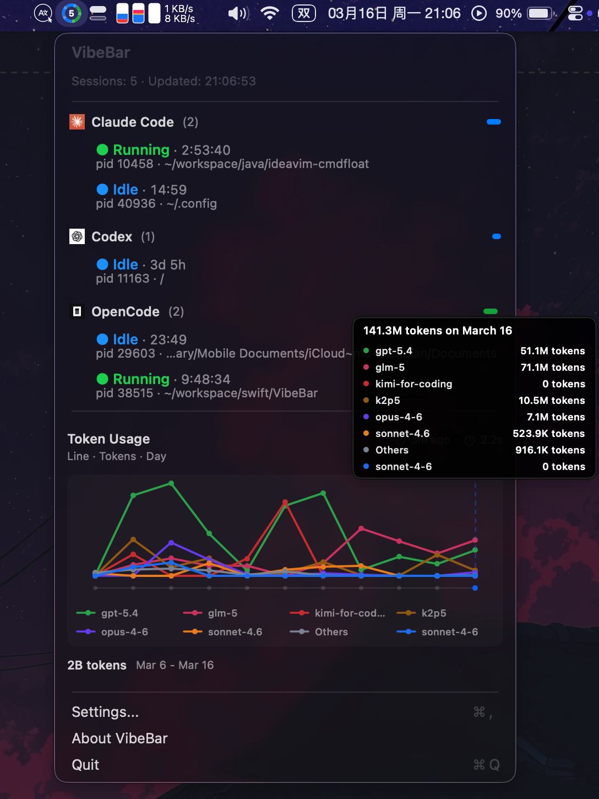
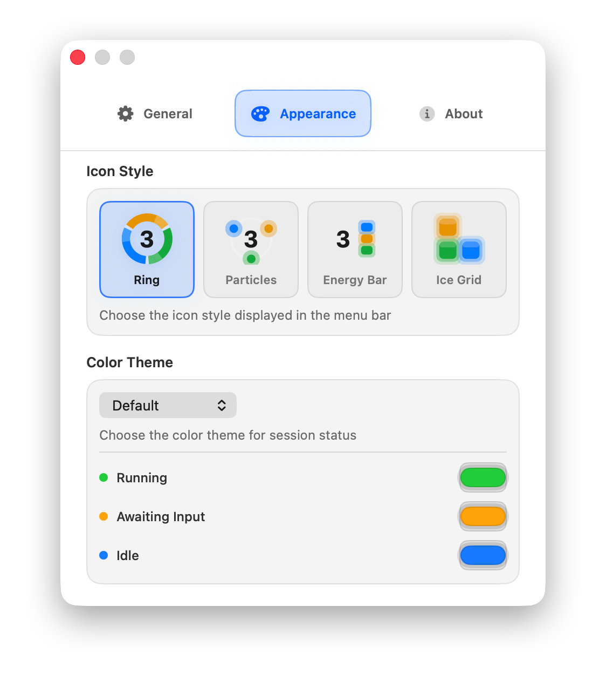

# VibeBar

**[English](README.md)** · [中文](README_zh.md) · [日本語](README_ja.md) · [한국어](README_ko.md)

VibeBar is a lightweight macOS menu bar app that monitors live TUI session activity for **Claude Code**, **Codex**, **OpenCode**, **Aider**, **Gemini CLI**, and **GitHub Copilot**.

<table>
  <tr>
    <th>Agent Sessions and Token Usage Trend</th>
    <th>Agent Session and Token Usage Trend</th>
  </tr>
  <tr>
    <td>
      
    </td>
    <td>
      
    </td>
  </tr>
</table>

Multiple icon styles and color schemes are provided, which can be configured in the settings.



## Recommended Integration (Important)

- **Claude Code**: use the VibeBar plugin (recommended).
- **OpenCode**: use the VibeBar plugin (recommended).
- **Aider**: use `vibebar` wrapper (recommended), and optionally `vibebar notify` for better awaiting-input signals.
- **Gemini CLI**: use `vibebar` wrapper (recommended). In headless/prompt mode, wrapper auto-enables `--output-format stream-json` unless already set.
- **GitHub Copilot**: use the VibeBar hooks plugin (recommended). Install from **Settings → Plugins → GitHub Copilot**; VibeBar auto-deploys `.github/hooks/hooks.json` to all running Copilot sessions' project directories. For projects opened after installation, click **Install** again or copy the hooks file manually.
- **Codex**: use `vibebar` wrapper (recommended), because Codex currently has no plugin system in this repo.
- `vibebar` wrapper supports `claude` / `codex` / `opencode` / `aider` / `gemini` / `copilot`, while plugin integration remains the preferred path where available.

## Features

- Real-time menu bar status for multiple sessions and tools.
- Optional notch display mode on supported MacBook screens, extending a small black icon area from the right side of the notch and automatically falling back to the standard menu bar entry on unsupported primary displays.
- Session states: `running`, `awaiting_input`, `idle`, `stopped`, `unknown`.
- Three data channels for reliability:
  - PTY wrapper (`vibebar`)
  - Local plugin events via `vibebar-agent`
  - `ps` process scanning fallback
- In-app plugin management (install/uninstall/update) for Claude Code, OpenCode, and GitHub Copilot.
- In-app wrapper command management for `vibebar`.
- Multiple icon styles, color themes, launch at login, and update checks.
- Multi-language UI (`English`, `中文`, `日本語`, `한국어`).

## Token Usage Tracking

VibeBar tracks token usage across supported AI tools with detailed analytics and visualization:

**Supported Tools:**
- **Claude Code** — reads from `~/.config/claude/projects/*/usage.jsonl`
- **Codex** — reads from `~/.codex/sessions/*/usage.jsonl`
- **OpenCode** — reads from `~/.local/share/opencode/opencode.db`

**Token Metrics:**
- Input tokens, Output tokens
- Cache read tokens, Cache write tokens
- Total tokens and estimated cost in USD

**Visualization Options:**
- **GitHub-style Heatmap** — 39-week activity matrix with color-coded intensity
- **Bar Chart** — Stacked bars showing usage by time period
- **Line Chart** — Trend lines for usage over time

**Configuration:**
- Toggle between **Tokens** or **Cost** view
- Adjust granularity: Hour / Day / Week / Month
- Group by: Tool / Model / None
- Set refresh interval: 5min / 15min / 30min / 1hour
- Customize maximum series displayed

Access via the menu bar dropdown to view your AI usage patterns and costs at a glance.

## Project Layout

- `VibeBarCore`: models, storage, aggregation, scanners, plugin/wrapper detection.
- `VibeBarApp`: macOS menu bar app and settings UI.
- `VibeBarCLI` (`vibebar`): PTY wrapper around target CLIs.
- `VibeBarAgent` (`vibebar-agent`): local Unix socket server for plugin events.
- `plugins/*`: Claude Code, OpenCode, and GitHub Copilot hook plugin packages.

## How Session Detection Works

VibeBar merges data from 3 channels:

1. `vibebar` PTY wrapper: high-fidelity interaction states.
2. `vibebar-agent` socket events: plugin lifecycle/status updates.
3. `ps` scan fallback: process-based discovery when stronger sources are missing.

State priority at tool level:

`running > awaiting_input > idle > stopped > unknown`

Runtime data paths:

- Session files: `~/Library/Application Support/VibeBar/sessions/*.json`
- Agent socket: `~/Library/Application Support/VibeBar/runtime/agent.sock`

## Installation

### Option A: Download app (recommended)

1. Download latest `VibeBar-*-universal.dmg` from [GitHub Releases](https://github.com/yelog/VibeBar/releases).
2. Drag `VibeBar.app` to `Applications`.
3. First launch: right-click app and choose **Open** (Gatekeeper).

### Option B: Homebrew

Add this repository as a tap and install:

```bash
brew tap yelog/vibebar https://github.com/yelog/vibebar.git
brew install --cask yelog/vibebar/vibebar
```

**Upgrade:**

```bash
brew upgrade --cask yelog/vibebar/vibebar
```

### Option C: Build from source

Requirements: macOS 13+, Xcode Command Line Tools, Swift 6.2.

```bash
swift build
```

## Quick Start (Source Build)

1. Start app:

```bash
swift run VibeBarApp
```

2. Start agent (recommended for plugin events):

```bash
swift run vibebar-agent --verbose
```

3. Install local plugins for Claude/OpenCode:

```bash
bash scripts/install/setup-local-plugins.sh
```

4. Install the GitHub Copilot hooks plugin (if using Copilot):

Open **VibeBar Settings → Plugins → GitHub Copilot → Install**. VibeBar will copy the hook script and auto-deploy `hooks.json` to all currently running Copilot sessions' project directories.

5. Run Codex with wrapper (recommended path):

```bash
swift run vibebar codex -- --model gpt-5-codex
```

6. Run Aider with wrapper (recommended path):

```bash
swift run vibebar aider -- --model sonnet
```

7. Optional: forward Aider notifications into VibeBar state updates:

```bash
aider --notifications --notifications-command "vibebar notify aider awaiting_input"
```

8. Run Gemini CLI with wrapper:

```bash
swift run vibebar gemini -p "explain this codebase"
```

For Gemini prompt/headless invocations (`-p`, `--prompt`, `--stdin`, or non-TTY stdin), `vibebar` automatically adds `--output-format stream-json` unless you already provide `--output-format`.

Gemini hooks integration example (`.gemini/settings.json`):

```json
{
  "hooks": {
    "SessionStart": [{
      "matcher": "*",
      "hooks": [{ "type": "command", "command": "vibebar notify gemini session_start session_id=$GEMINI_SESSION_ID" }]
    }],
    "AfterAgent": [{
      "matcher": "*",
      "hooks": [{ "type": "command", "command": "vibebar notify gemini after_agent session_id=$GEMINI_SESSION_ID" }]
    }],
    "SessionEnd": [{
      "matcher": "*",
      "hooks": [{ "type": "command", "command": "vibebar notify gemini session_end session_id=$GEMINI_SESSION_ID" }]
    }]
  }
}
```

9. Optional fallback: run Claude/OpenCode via wrapper when plugin is unavailable:

```bash
swift run vibebar claude
swift run vibebar opencode
```

Plugin docs:

- `plugins/README.md`
- `plugins/claude-vibebar-plugin/README.md`
- `plugins/opencode-vibebar-plugin/README.md`
- `plugins/copilot-vibebar-hooks/README.md`

## Development Commands

```bash
# Build
swift build
swift build -c release

# Run
swift run VibeBarApp
swift run vibebar-agent --verbose
swift run vibebar codex

# Test (placeholder)
swift test
```

Package universal `.dmg`:

```bash
bash scripts/build/package-app.sh
```

## Troubleshooting

- No menu bar icon: ensure local macOS GUI session (not headless/SSH).
- Stale sessions: use **Purge Stale** and verify session files path above.
- Missing plugin events: ensure `vibebar-agent` is running and check socket path:

```bash
swift run vibebar-agent --print-socket-path
```

## Limitations

- Without plugins, awaiting-input detection relies on heuristics.
- Codex has no plugin event channel in this repo yet.
- Aider has no native plugin event channel in this repo yet; use `vibebar notify` via `--notifications-command` for better awaiting-input detection.
- Gemini CLI transcript parsing is auxiliary only; it augments hook/process detection and should not be treated as a primary real-time source.
- GitHub Copilot hooks are per-repo: hooks.json must exist in each project's `.github/hooks/` directory. VibeBar auto-deploys this file when you click **Install**, but projects opened after installation require a second **Install** click (or manual copy).
- Automated tests are still minimal.

## Acknowledgments

This project was inspired by [ccusage](https://github.com/ryoppippi/ccusage). Thanks to [@ryoppippi](https://github.com/ryoppippi) for the great idea and implementation.
